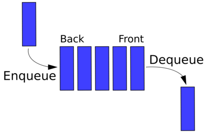
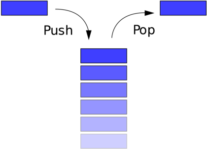
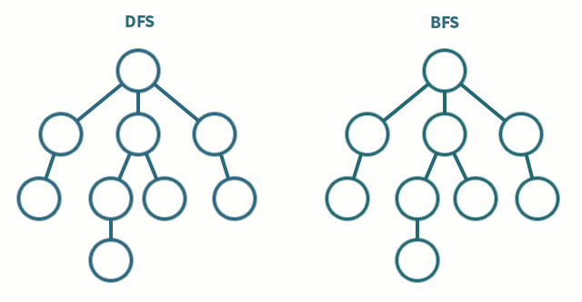

# Notes

## Memoization
Store the arguments and result of each function call.

If the function is called again with the same arguments, return the pre-computed result. 

## Data Structures
Ways of organising information with optimal __runtime complexity__ for adding or removing records
Javascript natively implements several data structures.

### Queue
First In First Out

### Stack
First In Last Out

### Linked List
An ordered collection of data, the collection contains a number of nodes.
Each node contains 
1. Data e.g. String, object etc.
2. A reference to the next node (A chain). 

* Head Node: The first node in a linked list,
* Tail Node: The last node in a linked list, identified as it doesn't have a reference to a subsequent node 

__Tip:__ When creating methods for a linked list, for read, insert & delete, favour a generic index e.g. `getIndex(i)` > `getFirst() & getLast()`

### Trees
A tree node contains:
1. Data
2. List of Child Nodes
Sibling nodes must share the same parent, *not* the same breadth aka. level

#### Breadth-First Traversal
Iterate through each level of the tree from first to last
Image 

#### Depth-First Traversal
Iterate down through the first-most child node continuously until the base, iterate each of these nodes, then move back up the tree to the imediate parent and continue the same process on the next sibling aka. second-most node
Image 

#### Binary Search Tree
Nodes can contain a max 2 child nodes aka left and right.
Restrict the values of the node, must be number(???)
Binary Search Tree !== Binary tree (which the following two rules don't apply)
The value of the left node must be less than the value of the parent node 
The value on the right node must be greater than the value of the parent node
