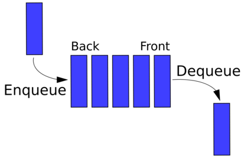
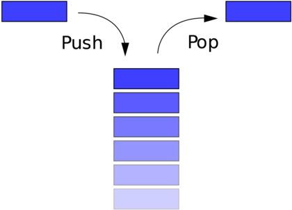
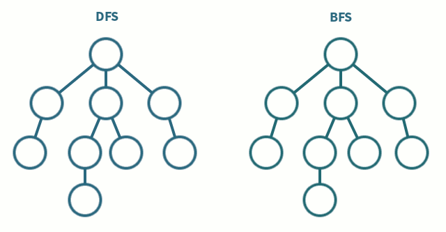

# JavaScript Algorithms and Data Structures

## Memoization

Store the arguments and result of each function call.

If the function is called again with the same arguments, return the pre-computed result.

## Searching

### Binary Search

Finding an item in a sorted list
Is the value greater or less than the midpoint of the array. Disregard the other half.

```js
const mid = Math.floor(arr.length / 2);
arr.splice(0, mid) || arr.splice(mid);
```

## Sorting

### Bubble Sort

Worst possible time complexity: n^2

```js
// implementing bubble sort
function bubbleSort(arr) {
  arr.map((num, i) => {
    for (let j = 0; j < arr.length - i - 1; j++) {
      if (arr[j] > arr[j + 1]) {
        const lesser = arr[j + 1];
        arr[j + 1] = arr[j];
        arr[j] = lesser;
      }
    }
  });
  return arr;
}
```

### Selection Sort

Worst possible time complexity: n^2

```js
// implementing select sort
function selectionSort(arr) {
  arr.map((num, i) => {
    let indexOfSmallest = i;
    for (let j = i + 1; j < arr.length; j++) {
      if (arr[indexOfSmallest] > arr[j]) {
        indexOfSmallest = j;
      }
    }
    const larger = arr[i];
    arr[i] = arr[indexOfSmallest];
    arr[indexOfSmallest] = larger;
  });
  return arr;
}
```

### Merge Sort

Worst possible time complexity: n\*log(n)

```js
// implementing merge sort
function mergeSort(arr) {
  if (arr.length === 1) return arr;
  const center = Math.floor(arr.length / 2);
  const left = arr.slice(0, center);
  const right = arr.slice(center);
  return merge(mergeSort(left), mergeSort(right));
}

function merge(left, right) {
  const arr = [];
  while (left.length && right.length) {
    left[0] < right[0] ? arr.push(left.shift()) : arr.push(right.shift());
  }
  return [...arr, ...left, ...right];
}
```

# Data Structures

Refer to the ways of organising information with optimal **runtime complexity** for adding or removing records

_\*Javascript natively implements several data structures_

## Queue

**First In First Out**

```js
// Example of a queue
class Queue {
  constructor() {
    this.data = [];
  }
  add(record) {
    this.data.unshift(record);
  }
  remove() {
    return this.data.pop();
  }
}
```



## Stack

**First In Last Out**

```js
// Example of a stack
class Stack {
  constructor() {
    this.data = [];
  }
  push(n) {
    this.data.push(n);
  }
  pop() {
    return this.data.pop();
  }
  peek() {
    return this.data[this.data.length - 1];
  }
}
```



## Linked List

An ordered collection of data, the collection contains a number of nodes.
Each node contains

1. Data e.g. String, object etc.
2. A reference to the next node (A chain).

- Head Node: The first node in a linked list,
- Tail Node: The last node in a linked list, identified as it doesn't have a reference to a subsequent node

**Tip:** When creating methods for a linked list, for read, insert & delete, favour a generic index e.g. `getIndex(i)` > `getFirst() & getLast()`

## Trees

A tree node contains:

1. Data
2. List of Child Nodes
   Sibling nodes must share the same parent, _not_ the same breadth aka. level

```js
// Example of a tree
class Node {
  constructor(data, children = []) {
    this.data = data;
    this.children = children;
  }
  add(data) {
    const node = new Node(data);
    this.children.push(node);
  }
  remove(data) {
    this.children = this.children.filter(node => node.data !== data);
  }
}
```

### Breadth-First Traversal

Iterate through each level of the tree from first to last

```js
// implementing breadth-first traversal
traverseBF(func) {
 let arr = [this.root];
 while (arr.length) {
   const node = arr.shift();
   arr = [
     ...arr,
     ...node.children
   ];
   func(node);
 }
}
```

### Depth-First Traversal

Iterate down through the first-most child node continuously until the base, iterate each of these nodes, then move back up the tree to the immediate parent and continue the same process on the next sibling aka. second-most node

```js
// implementing depth-first traversal
traverseDF(func) {
  let node = this.root;
  let arr = [node];
  while (arr.length) {
    node = arr.shift();
    arr = [
      ...node.children,
      ...arr,
    ]
    func(node);
  }
}
```



### Binary Search Tree

Nodes can contain a max 2 child nodes aka left and right.
Restrict the values of the node, must be number(???)
Binary Search Tree !== Binary tree (which the following two rules don't apply)
The value of the left node must be less than the value of the parent node
The value on the right node must be greater than the value of the parent node

```js
// Example of a binary search tree
class Node {
  constructor(data, left = null, right = null) {
    this.data = data;
    this.left = left;
    this.right = right;
  }
  insert(data) {
    if (data < this.data) {
      this.left ? this.left.insert(data) : (this.left = new Node(data));
    }
    if (data > this.data) {
      this.right ? this.right.insert(data) : (this.right = new Node(data));
    }
  }
  contains(data) {
    if (data === this.data) return this;
    if (data < this.data) {
      return this.left ? this.left.contains(data) : null;
    }
    if (data > this.data) {
      return this.right ? this.right.contains(data) : null;
    }
    return null;
  }
}
```
